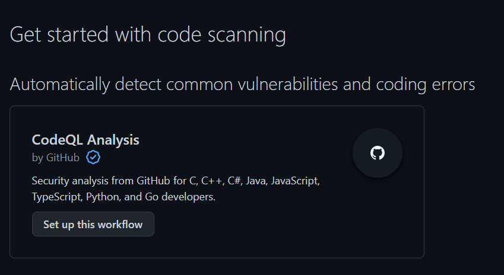
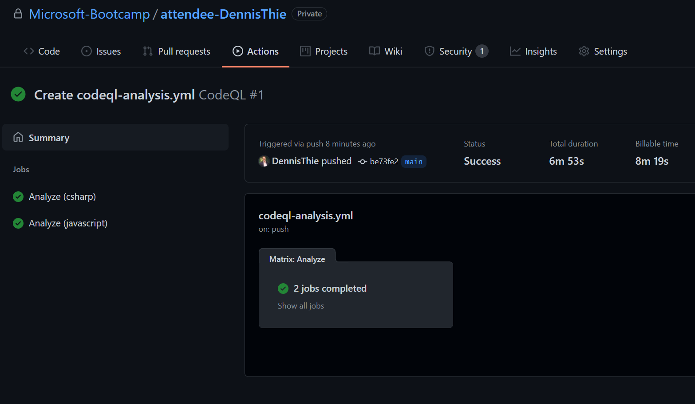
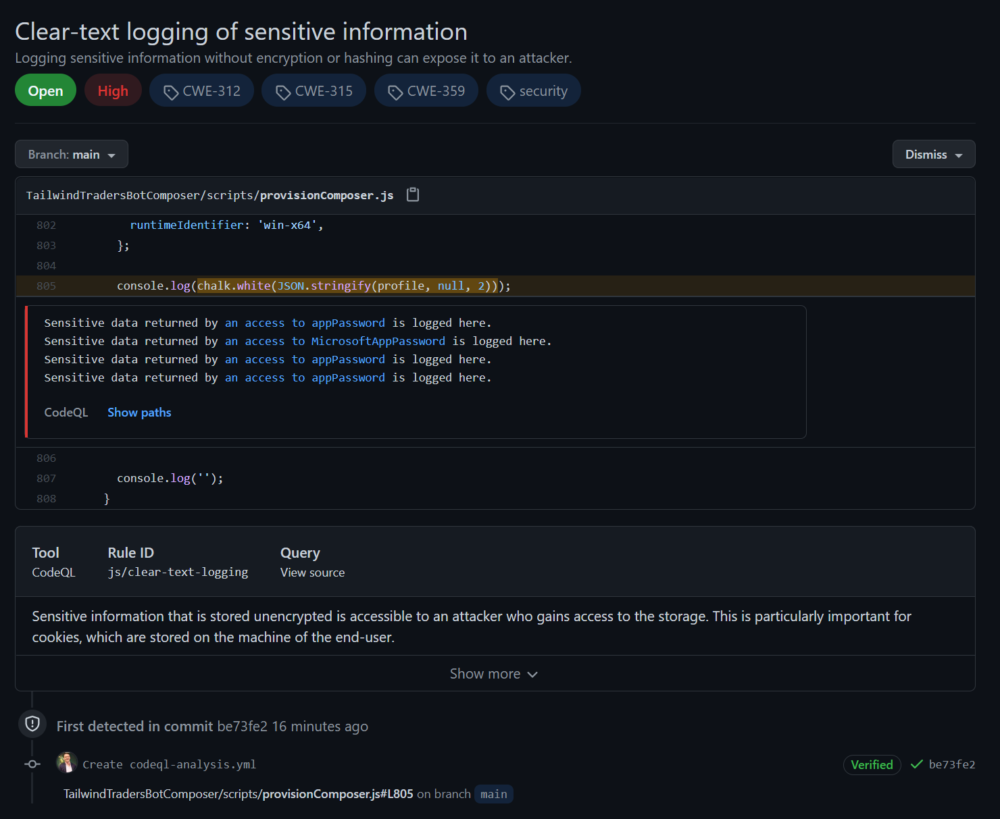

# 3.3 Setting up Code Scanning and Secret Scanning for your repository
In this lab you will:
 - Learn how to set up code scanning for repositories
 - Experience how code scanning enables you to find security vulnerabilities
 
 Good luck! 👍

This hands on lab consists of the following steps:
- [Enabling GitHub Advanced Security on your repository](#enabling-github-advanced-security-on-your-repository)
- [Code Scanning: What is it?](#code-scanning-what-is-it)
- [Enabling the Code Scanning functionality](#enabling-the-code-scanning-functionality)
- [Analyzing Code Scanning outcomes](#analyzing-code-scanning-outcomes)

## Enabling GitHub Advanced Security on your repository
Should GitHub Advanced Security not be enabled yet on your repository, you can enable it from the `Settings` menu on your repository, then under `Security & Analysis`, in the section `GitHub Advanced Security`, click `Enable`. Advanced Security should be enabled in order to enable Code Scanning and Secret Scanning.

## Code Scanning: What is it?
Code scanning is a feature that you use to analyze the code in a GitHub repository to find security vulnerabilities and coding errors. Any problems identified by the analysis are shown in GitHub.

You can use code scanning to find, triage, and prioritize fixes for existing problems in your code. Code scanning also prevents developers from introducing new problems. You can schedule scans for specific days and times, or trigger scans when a specific event occurs in the repository, such as a push. If code scanning finds a potential vulnerability or error in your code, GitHub displays an alert in the repository. After you fix the code that triggered the alert, GitHub closes the alert. For more information, see [Managing code scanning alerts for your repository](https://docs.github.com/en/code-security/secure-coding/managing-code-scanning-alerts-for-your-repository]).

For GitHub Code Scanning documentation, please refer to: [https://docs.github.com/en/code-security/code-scanning/automatically-scanning-your-code-for-vulnerabilities-and-errors/about-code-scanning](https://docs.github.com/en/code-security/code-scanning/automatically-scanning-your-code-for-vulnerabilities-and-errors/about-code-scanning)

### Enabling the Code Scanning functionality
To enable GitHub Code Scanning, please navigate to the `Settings` of your repository, click `Security & analysis` click `Set up` for the `Code Scanning` feature.

You'll be directed to the `Get started with Code Scanning` form, from where you can set up code scanning to use the *CodeQL Analysis* product maintained by GitHub or a third-party code scanning tool. For this lab, we'll pick the CodeQL product. To enable this, you'll click the `Set up this workflow` for the `CodeQL Analysis` product maintained by Github.

After this step, a `codeql-analysis.yml` file is generated for you. For most projects, this workflow file will not need changes; you can simply commit it to your repository. 

Once your changes are committed, you will see the `codeql-analysis.yml` file in the new directory `./github/workflows`.

When you click the file `codeql-analysis.yml`, you get to see the option `View runs`. 

From here, you can see the list of workflows with the CodeQL workflow and the run history of the CodeQL workflow. In the default CodeQL analysis workflow, code scanning is configured to analyze your code each time you either push a change to the default branch or any protected branches, or raise a pull request against the default branch. As a result, code scanning will now commence. As you can see on the below screenshot, the workflow is currently running.

Reviewing any failed analysis job

After some minutes, generally around 7 to 8 minutes, the workflow run will be completed and you will see the status being updated.

Clicking through on the workflow run, by clicking on `Create codeql-analysis.yml`, you can see the details of the workflow run. 

Great, now that your CodeQL workflow is completed, we can move on and discover the way your Code Scanning outcomes can be analyzed. 

### Analyzing Code Scanning outcomes
When you navigate to the `Security` tab on your repository, and click `Code Scanning alerts`, you can see the active alerts for Code Scanning. From this view, you can view, fix, dismiss, or delete alerts for potential vulnerabilities or errors in your project's code.

Each alert highlights a problem with the code and the name of the tool that identified it. You can see the line of code that triggered the alert, as well as properties of the alert, such as the severity, security severity, and the nature of the problem. Alerts also tell you when the issue was first introduced. For alerts identified by CodeQL analysis, you will also see information on how to fix the problem.

For more detailed information on managing the Code Scanning alerts, refer to: [https://docs.github.com/en/code-security/code-scanning/automatically-scanning-your-code-for-vulnerabilities-and-errors/managing-code-scanning-alerts-for-your-repository](https://docs.github.com/en/code-security/code-scanning/automatically-scanning-your-code-for-vulnerabilities-and-errors/managing-code-scanning-alerts-for-your-repository)
