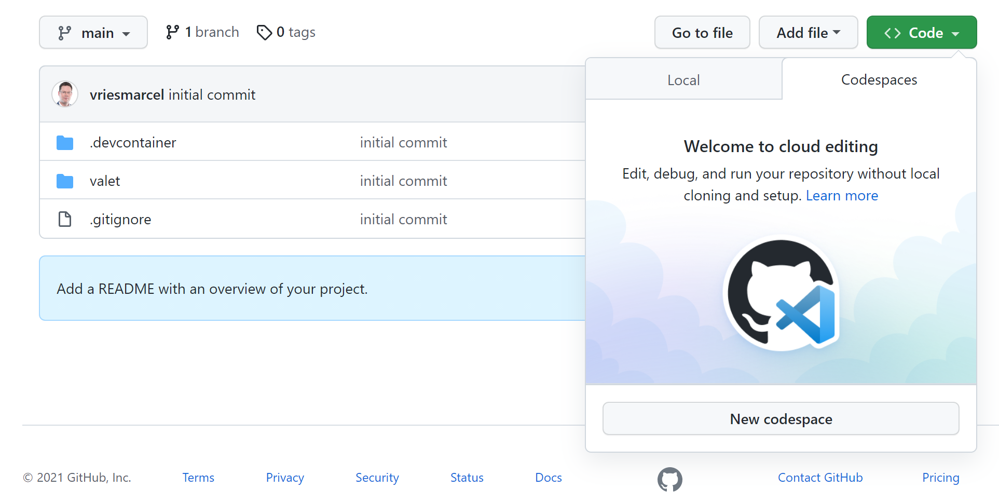

# 5 Migrating pipelines from Azure DevOps to GitHub Actions using GitHub Actions Importer 
In this hands-on lab you will get a first glance at the tooling that is build to migrate CI/CD solutions to GitHub actions. This tool is called **GitHub Actions Importer (GAI)**.

We will start with setting up the tools, use the tools for a dry-run and do a migration of one pipeline to Azure DevOps to get a feel on how the tools work.

This hands on lab consists of the following steps:
- [Generate GitHub a Personal Access Token](#generate-a-github-personal-access-token)
- [Add Personal Access Tokens To Codespaces](add-personal-access-tokens-to-codespaces)
- [Add postCreateCommand to the devcontainer json](add-postCreateCommand-to-the-devcontainer-json)
- [Setting up your CodeSpaces development environment](#setting-up-your-codespaces-development-environment)
- [Run an audit on the existing Azure DevOps project](#run-an-audit-on-the-existing-azure-devops-project)
- [Execute the migration](#execute-the-migration)

## Generate a GitHub Personal Access Token
Before we move to the step where we execute the migration, you first need to generate a Personal Access Token. 
1. To do so, navigate to your GitHub Settings - click your profile photo and go to Settings or follow [this link](https://github.com/settings/profile).
2. Go to `Developer Settings`
3. Go to `Personal Access Tokens`
4. Click `Generate new token`. If required, provide your password.
5. Select at least the scopes `read packages` and `workflow`. Optionally, provide a text in the field `Note` and change the `Expiration`. 
6. Click `Generate token`
7. Your token is now generated. Make sure to copy your token, as you will not be able to retrieve it later on. Move to the next step ([Execute the migration](#execute-the-migration)) where you will use this token.

## Add Personal Access Tokens To Codespaces

### Add Azure DevOps Secret

2. Work inside your current repository `Microsoft-Bootcamp/attendee-<your-github-handle>`
3. Click the `Settings` tab
4. Click `Secrets` then `Codespaces`
5. Click `New Repository Secret`
6. In the Name field type `AZURE_DEVOPS_ACCESS_TOKEN`
7. Paste in **ASK INSTRUCTOR**
8. Click `Add Secret`

## Add postCreateCommand to the devcontainer json
1. Work inside your current repository `Microsoft-Bootcamp/attendee-<your-github-handle>`
2. Open the `.devcontainer` folder
3. Open the `devcontainer.json` file
4. Click `Edit`
5. Add the below postCreateCommand to the end of the file:
6. Add the following customizations to the body of the file before the last `}`.
```
  ,
	"postCreateCommand": "docker pull ghcr.io/valet-customers/valet-cli:latest && gh extension install github/gh-actions-importer || echo 'Could not auto-build. Skipping.' "
```
The full `devcontainer.json` file should look like this.


## Setting up your CodeSpaces development environment
Now before we continue the hands-on lab, go to your repository and start your Codespace instance by clicking the button `Code`, then the tab `Codespaces` and select `New Codespace`.



### Please wait for this to complete. The reason it takes some more time the first time has to do with the fact the container needs to be build for the first time. Next time you start a Codespace you will get access in a few seconds.

## GAI is already added to Codespaces development environment

GAI uses a Docker container to do all the work. This container is available the moment you are onboarded to GAI.

Let us get started by setting up the tools so they work.

### Verify image for GAI

In the terminal window in your Codespace environment (or in Visual Studio Code if you prefer to use that)
type at the command-line:

```
docker images
```
  
This should return a list of images
  
```
codespace ➜ /workspaces/attendee-github-handle (main) $  docker images
REPOSITORY                          TAG       IMAGE ID       CREATED        SIZE
ghcr.io/valet-customers/valet-cli   latest    f4a34ec3baea   18 hours ago   141MB
```
  
The codespace you're using has already pulled the `valet-cli` image!

### If codespaces was unable to pull the image you can try to pull it manually. Ask instructor for help.

Now, we want to try to create some migrations of the Azure DevOps project that you can find in the BootcampLabs Repository (https://dev.azure.com/microsoft-bootcamp/_git/BootcampExercises). 
The Team project name we can use for this exercise is **BootcampExercises**.

> Note: please feel free to use your own Azure DevOps projects, the lab is more step by step prepared, feel free to go of script here!

In your terminal, change directory to the folder `valet` on your local repo in your codespaces IDE by.
```
cd Valet
```
  
Try to run `actions-importer` by typing the below. 
```
gh actions-importer
```

It should now output the valet commands that are available:

```
Options:
  -?, -h, --help  Show help and usage information

Commands:
  update     Update to the latest version of actions-importer
  version    Check the version of the actions-importer docker container.
  configure  Start an interactive prompt to configure credentials used to authenticate with your CI server(s).
  audit      An audit will output a list of data used in a CI/CD instance.
  dry-run    Convert a pipeline to a GitHub Actions workflow and output its yaml file.
  migrate    Convert a pipeline to a GitHub Actions workflow and open a pull request with the changes.
  forecast   Forecasts GitHub actions usage from historical pipeline utilization.
```
  
## Run an audit on the existing Azure DevOps project
  
To run actions-importer commands we need to pass in the arguments at each command or we can set up a file called `.env.local`. We provided this file already in the Valet folder. It is most convenient to use this file and only fill in the missing details for Azure DevOps and for GitHub. 
  
Add the following parameters to the file:
NOTE: Paste in the GitHub Personal Access Token created in step 1.
```
GITHUB_ACCESS_TOKEN=<your github token here>
GITHUB_INSTANCE_URL=https://github.com

AZURE_DEVOPS_PROJECT=BootcampExercises
AZURE_DEVOPS_ORGANIZATION=microsoft-bootcamp
AZURE_DEVOPS_INSTANCE_URL=https://dev.azure.com/microsoft-bootcamp
```
Now, from the `./valet` folder in your repository, run actions-importer to verify your Azure DevOps configuration:
  
```
gh actions-importer audit azure-devops --output-dir . 
```

This will run the tool with the options you specified in the `.env.local` file.

The output of this audit run will result in a set of files that got generated to become the future action workflows and a summary page that contains the output of the audit. 
Here you can see how the migration will happen and how successful it will be. Note that not everything will be migrated and manual fixes are needed to succeed.
 
Inspect the file `audit_summary.md` and look at the results of the audit migration

# Execute the migration
  
Now we are going to migrate one of the successful pipelines. 

Now, we can run the command line and need to pass it the pipeline command. This command also requires to pass in a --target-url, which is the GitHub repo you are targeting. This is the location `https://github.com/Microsoft-Bootcamp/<your-repo-name>`.  

The Bootcamps Azure DevOps pipeline's definition-id is 54.

Then, again from the `valet` folder, we can run the following command to execute the migration:
```
gh actions-importer migrate azure-devops pipeline --target-url https://github.com/Microsoft-Bootcamp/<your-repo-name> --pipeline-id 54 --output-dir ./migrate
```

You will find the following results:
  
```
WARNING: `Faraday::Connection#authorization` is deprecated; it will be removed in version 2.0.                                    
While initializing your connection, use `#request(:authorization, ...)` instead.
See https://lostisland.github.io/faraday/middleware/authentication for more usage info.
[2022-04-19 16:49:46] Pull request: 'https://github.com/Microsoft-Bootcamp/dkalmin-4-18-test2/pull/1'    
 ```

The last line shows you a pull request that got created on the target repository that contains the migrated workflow.
This will look as follows:


Now, inspect the pull request and the action workflow that is part of the pull request.
Merge the pull request and run the workflow manually.

Success! The Action should run and run successfully

### Now lets fail a PR
Again from the `valet` folder, we can run the following command to execute the migration:
```
gh actions-importer migrate azure-devops pipeline --target-url https://github.com/Microsoft-Bootcamp/<your-repo-name> --pipeline-id 53 --output-dir ./migrate
```

You will find the following results with a NEW pull request:
  
```
[2022-04-19 16:49:46] Pull request: 'https://github.com/Microsoft-Bootcamp/dkalmin-4-18-test2/pull/1' 
```

The result is a new PR in GitHub. The build that runs will fail. You can manually fix the workflow in the next lab. [look at the FAQ for tips](../faq.md), or we can fix actions-importer. The next lab will look into that.
  
