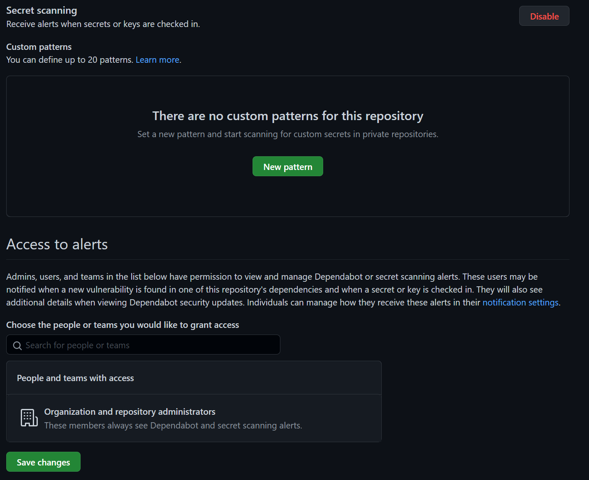

# 7 Setting up Secret Scanning for your repository
In this lab you will:
 - Learn how to enable secret scanning
 - Experience how secret scanning scans your repository for known types of secrets
 - Learn the capabilities of secret scanning that help to prevent fraudulent use 
 
 Good luck! 👍

This hands on lab consists of the following steps:
- [Secret Scanning: What is it?](#secret-scanning-what-is-it)
- [Enabling Secret Scaning functionality](#enabling-secret-scanning-functionality)
- [Managing Secret Scanning alerts](#managing-secret-scanning-alerts)
- [Secret Scanning: Alert notifications](#secret-scanning-alert-notifications)
- [Secret Scanning: Securing compromised secrets](#secret-scanning-securing-compromised-secrets)
- [Triggering Secret Scanning by inserting a connection string](#triggering-secret-scanning-by-inserting-a-connection-string)

## Enabling GitHub Advanced Security on your repository
Should GitHub Advanced Security not be enabled yet on your repository, you can enable it from the `Settings` menu on your repository, then under `Security & Analysis`, in the section `GitHub Advanced Security`, click `Enable`. Advanced Security should be enabled in order to enable Code Scanning and Secret Scanning.

## Secret Scanning: What is it?
If your project communicates with an external service, you might use a token or private key for authentication. Tokens and private keys are examples of secrets that a service provider can issue. If you check a secret into a repository, anyone who has read access to the repository can use the secret to access the external service with your privileges. We recommend that you store secrets in a dedicated, secure location outside of the repository for your project.

Secret scanning will scan your entire Git history on all branches present in your GitHub repository for any secrets. Service providers can partner with GitHub to provide their secret formats for scanning. For more information, see "Secret scanning partner program."

If someone checks a secret with a known pattern into a public or private repository on GitHub, secret scanning catches the secret as it's checked in, and helps you mitigate the impact of the leak. Repository administrators are notified about any that contains a secret, and they can quickly view all detected secrets in the Security tab for the repository.

For GitHub Secret SCanning documentation, please refer to: [https://docs.github.com/en/code-security/secret-scanning/about-secret-scanning](https://docs.github.com/en/code-security/secret-scanning/about-secret-scanning)

### Enabling Secret Scanning functionality
Depending on your GitHub settings Secret Scanning may already be enabled. To turn GitHub Secret Scanning, please navigate to the `Settings` of your repository, click `Security & analysis` click `Enable` for the `Secret Scanning` feature.


Secret Scanning is now enabled for your repository. 

GitHub performs secret scanning on public and private repositories for secret patterns provided by GitHub and GitHub partners. However, there can be situations where you want to scan for other secret patterns in your private repositories. For example, you might have a secret pattern that is internal to your organization. For these situations, you can define custom secret scanning patterns in your enterprise, organization, or private repository on GitHub.



You can define up to 20 custom patterns for each private repository, organization, or enterprise account and options to define these are enabled after you enable the `Secret Scanning` feature in your `Security & analysis` settings. We'll not go into the custom patterns in this lab, but for more information refer to: [https://docs.github.com/en/code-security/secret-scanning/defining-custom-patterns-for-secret-scanning](https://docs.github.com/en/code-security/secret-scanning/defining-custom-patterns-for-secret-scanning)

Now that you've set up Secret Scanning, let's understand where you can view the Secret Scanning alerts and ultimately try it out and trigger it ourselves by inserting a connection string in the next parts of the lab exercise.

### Managing Secret Scanning alerts
When you navigate to the `Security` tab on your repository, and click `Secret Scanning alerts`, you can see the active alerts for Secret Scanning. Here, you can view and close alerts for secrets checked in to your repository.


When you click on a Secret Scanning alert, you can see it's details.


#### Secret Scanning: Alert notifications
When a new secret is detected, GitHub notifies all users with access to security alerts for the repository according to their notification preferences. You will receive alerts if you are watching the repository, have enabled notifications for security alerts or for all the activity on the repository, are the author of the commit that contains the secret and are not ignoring the repository.

#### Secret Scanning: Securing compromised secrets
Once a secret has been committed to a repository, you should consider the secret compromised. GitHub recommends the following actions for compromised secrets:
* For a compromised GitHub personal access token, delete the compromised token, create a new token, and update any services that use the old token. 
* For all other secrets, first verify that the secret committed to GitHub is valid. If so, create a new secret, update any services that use the old secret, and then delete the old secret.

For more information, please refer to: [https://docs.github.com/en/code-security/secret-scanning/managing-alerts-from-secret-scanning](https://docs.github.com/en/code-security/secret-scanning/managing-alerts-from-secret-scanning)

### Triggering Secret Scanning by inserting a connection string
You can trigger the Secret Scanning functionality by inserting a secret in your repository yourself. To do so, try if you can manage to execute the following steps:
* Locate the GitHub PAT you created during the Codespace exercise OR create a new PAT
* Go back to your code
* Open the file `/code/src/AttendeeSite/appsettings.json`, 
* At the end of the file, append the file with a `ConnectionString` element and paste the copied GitHub PAT. 
* File should look like this
```
{
  "Logging": {
    "LogLevel": {
      "Default": "Information",
      "Microsoft": "Warning",
      "Microsoft.Hosting.Lifetime": "Information"
    }
  },
  "AllowedHosts": "*",
  "ConnectionString": "PASTE GITHUB PAT"
}
```
* Commit your changes and see whether you have been able to trigger a Secret Scanning alert (give the workflow some time to run after the commit) 
