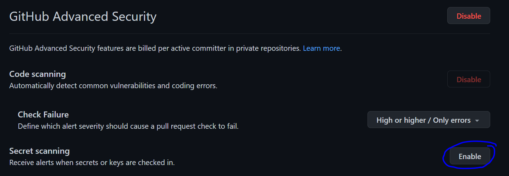

# 8 Setting up Secret Scanning for your repository
In this lab you will:
 - Learn how to enable secret scanning
 - Experience how secret scanning scans your repository for known types of secrets
 - Learn the capabilities of secret scanning that help to prevent fraudulent use 
 
 Good luck! 👍

This hands on lab consists of the following steps:
- [Secret Scanning: What is it?](#secret-scanning-what-is-it)
- [Enabling Secret Scaning functionality](#enabling-secret-scanning-functionality)
- [Managing Secret Scanning alerts](#managing-secret-scanning-alerts)
- [Secret Scanning: Alert notifications](#secret-scanning-alert-notifications)
- [Secret Scanning: Securing compromised secrets](#secret-scanning-securing-compromised-secrets)
- [Triggering Secret Scanning by inserting a connection string](#triggering-secret-scanning-by-inserting-a-connection-string)

## Enabling GitHub Advanced Security on your repository
Should GitHub Advanced Security not be enabled yet on your repository, you can enable it from the `Settings` menu on your repository, then under `Security & Analysis`, in the section `GitHub Advanced Security`, click `Enable`. Advanced Security should be enabled in order to enable Code Scanning and Secret Scanning.

## Secret Scanning: What is it?
If your project communicates with an external service, you might use a token or private key for authentication. Tokens and private keys are examples of secrets that a service provider can issue. If you check a secret into a repository, anyone who has read access to the repository can use the secret to access the external service with your privileges. We recommend that you store secrets in a dedicated, secure location outside of the repository for your project.

Secret scanning will scan your entire Git history on all branches present in your GitHub repository for any secrets. Service providers can partner with GitHub to provide their secret formats for scanning. For more information, see "Secret scanning partner program."

If someone checks a secret with a known pattern into a public or private repository on GitHub, secret scanning catches the secret as it's checked in, and helps you mitigate the impact of the leak. Repository administrators are notified about any that contains a secret, and they can quickly view all detected secrets in the Security tab for the repository.

For GitHub Secret SCanning documentation, please refer to: [https://docs.github.com/en/code-security/secret-scanning/about-secret-scanning](https://docs.github.com/en/code-security/secret-scanning/about-secret-scanning)

### Enabling Secret Scanning functionality
Depending on your GitHub settings Secret Scanning may already be enabled. To turn GitHub Secret Scanning, please navigate to the `Settings` of your repository, click `Security & analysis` click `Enable` for the `Secret Scanning` feature.



Secret Scanning and Push Protection is now enabled for your repository. 

### Triggering Push Protection by trying to add a GitHub Token as a connection string.
You can trigger the Secret Scanning Push Protection functionality by inserting a secret in your repository yourself. To do so, try if you can manage to execute the following steps:
* Locate the GitHub PAT you created during the Codespace exercise OR create a new PAT
* Go back to your code
* Open the file `/code/src/AttendeeSite/appsettings.json`, 
* At the end of the file, append the file with a `ConnectionString` element and paste the copied GitHub PAT. 
* File should look like this
```
{
  "Logging": {
    "LogLevel": {
      "Default": "Information",
      "Microsoft": "Warning",
      "Microsoft.Hosting.Lifetime": "Information"
    }
  },
  "AllowedHosts": "*",
  "ConnectionString": "PASTE GITHUB PAT"
}
```
* Try and commit your changes and see whether you will be able to. Push protection should stop the commit before it happens.

### Triggering Secret Scanning by inserting a custom connection string
* Go back to your code
* Open the file `/code/src/AttendeeSite/appsettings.json`, 
* At the end of the file, append the file with a `ConnectionString` element and paste the copied GitHub PAT. 
* File should look like this
```
{
  "Logging": {
    "LogLevel": {
      "Default": "Information",
      "Microsoft": "Warning",
      "Microsoft.Hosting.Lifetime": "Information"
    }
  },
  "AllowedHosts": "*",
  "ConnectionString": "asdfasdfasdf"
}
```
* Commit your changes to main.
* Go to `Settings`
* Go to `Code security & analysis`
* Under `Secret Scanning` and `Custom patterns` click `New pattern`
* Name the patter `ASDF`
* Under `Secret format` add `asdfasdfasdf`
* Add `asdfasdfasdf` to the `Test pattern` box
* Click `Security & Analysis` at the top
* click `edit` for the new custom pattern
* scroll down and click `Publish pattern`
* Click on the `Security` tab and view the Secret alert.
